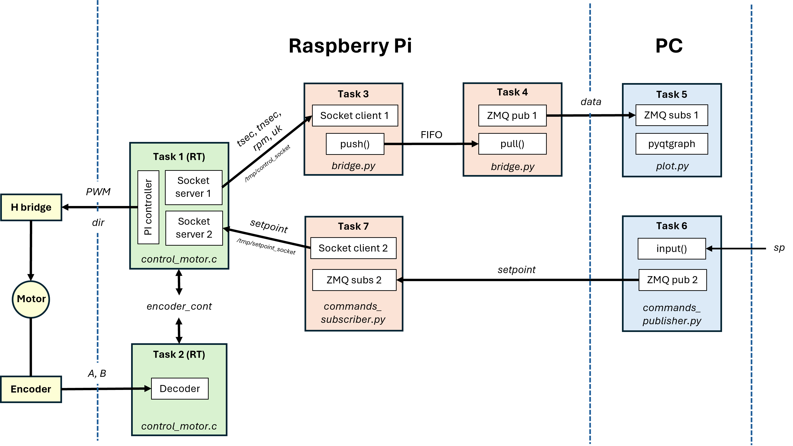
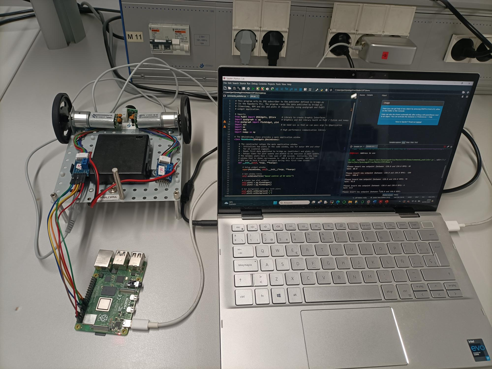
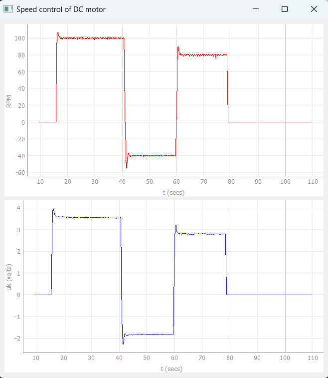

# Project-estructuras-software-para-SOPC

## Master SIEAV

The project scheme is as follows:

The experimental set-up is shown in the following picture:

And the results are displayed through `pyqtgraph`:

*Note: in this test the sequence of the setpoint is 100,-40, 80 and 0 rpm* 

---

A project developed by `Unai Sainz`, `Javier Herrero` and `Oscar Rojo`.

